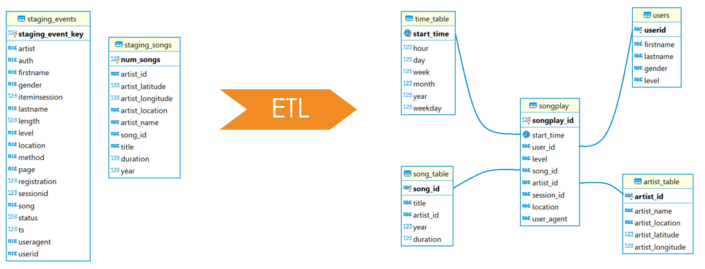
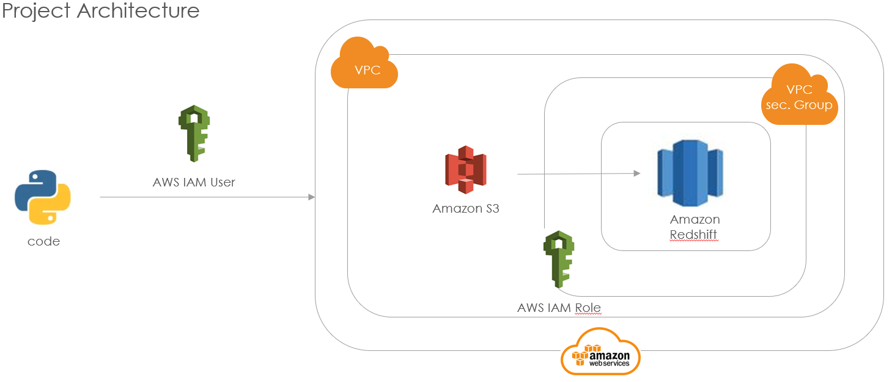
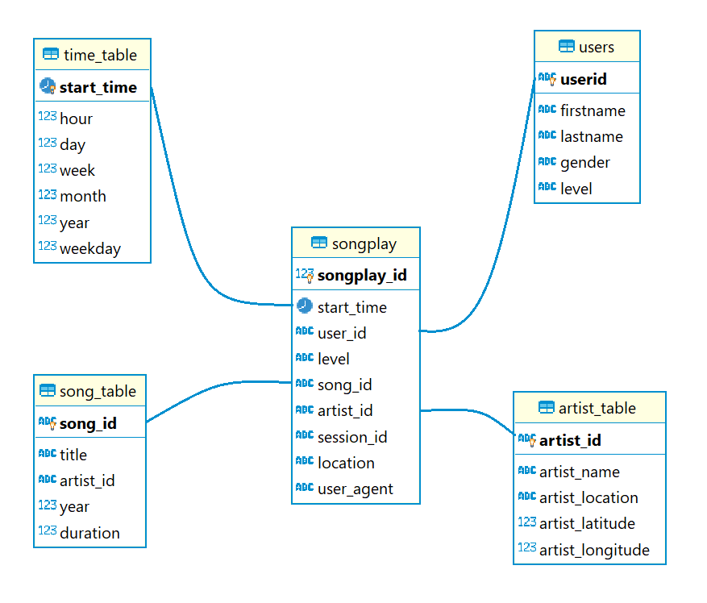

# Cloud Data Warehouses
Data Modeling for the company Sparkify. The data is a collection of songs and user activities on their new music streaming app. The goal of the program is to understand what songs users are listening to. The information comes from two JSON directories, the datasets are located in S3 AWS. The program is a postgreSQL database with tables for optimizing song playback queries. The ETL pipeline was created in Python.\
\
**ETL explanation**
\
 \
 **DWH Architecture**\
The architecture was made in AWS and consists of a redshift cluster. the cluster accesses two S3 folders and loads 2 JSON dataset. From the 2 datasets the dim. and fac. tables are created and loaded\
\

## JSON directories (Start Dataset)
**Song Dataset**\
The first dataset is a subset of real data from the Million Song Dataset. Each file is in JSON format and contains metadata about a song and the artist of that song.\
columns: artist_id, artist_latitude, artist_location,artist_longitude, artist_name, duration, num_songs, song_id, title, year\
Folder path: 's3://udacity-dend/song_data'\

**Log Dataset**\
The second dataset consists of log files in JSON format generated by this event simulator. These simulate activity logs from a music streaming app based on specified configurations.\
columns: artist, auth, firstName, gender, itemInSession, lastName, length, level, location, method, page, registration, sessionId, song, status, ts, userAgent, userId\
It will be only load the row if page = NextSong\
Folder path: 's3://udacity-dend/log_data' ; 's3://udacity-dend/log_json_path.json'\

**Dimension Table**\
-Data from Song Dataset as staging_song (song_table, artist_table)
1) song_table: song_id, title, artist_id, year, duration
2) artist_table: artist_id, artist_name, artist_location, artist_latitude, artist_longitude

-Data from Log Dataset as staging_events (time_table, users) + page = NextSong
1) time_table: start_time, hour, day, week, month, year, weekday
2) users: userId, firstName, lastName, gender, level

**Fact Table**\
JOIN beteween staging_song und staging_events (songplay)\
songplay:  songplay_id, start_time, user_id, level, song_id, artist_id, session_id, location, user_agent\

## Program description steps (create_tables.py and etl.py)
**1) create_tables.py**\
    1.1) Connect to datawarehouse and SQL database\
    1.2) Drop all tables with fuction drop_tables\
    1.3) Create all tables with the fuction create_tables

**2) etl.py**\
    2.1) Connect to datawarehouse and SQL database\
    2.2) Copy the information of the two S3 AWS datasets into SQL tables (staging_song, staging_events(page=NextSong)) with the function load_staging_tables\
    2.3) Load the information from the staging tables into the fact and dim tables

## queries
### sql_queries.py
in sql_queries.py are the 4 kinds of basics queries: 

basic queries:
#### Drop table
    staging_events_table_drop
    staging_songs_table_drop
    songplay_table_drop
    user_table_drop
    song_table_drop
    artist_table_drop
    time_table_drop
#### Create table
    staging_events_table_create
    staging_songs_table_create
    songplay_table_create
    user_table_create
    song_table_create
    artist_table_create
    time_table_create
#### load_staging_tables from S3 AWS into SQL
    staging_events_copy
    staging_songs_copy 
#### insert into fact and dim tables SQL
    songplay_table_insert
    user_table_insert
    song_table_insert
    artist_table_insert
    time_table_insert

## DHW information 
**dhw.cfg**\
in the file dhw is the information about the AWS cluster in redschift and the AIM role. The path from the S3-buckets are in this file as well
